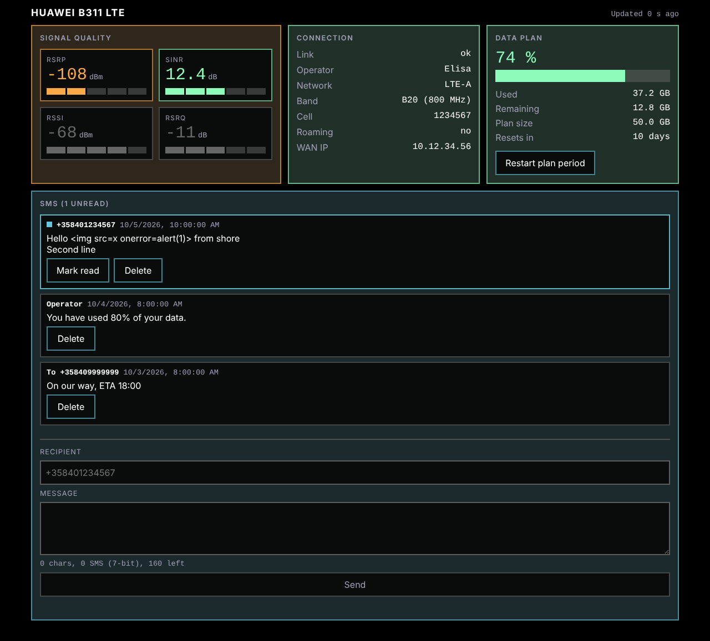

# signalk-huawei-b311-221

A [Signal K](https://signalk.org) server plugin for the Huawei B311-221 LTE
router, the common boat internet box. It publishes signal quality,
connection status and data usage as Signal K paths, tracks your data plan,
and lets you read and send SMS from a small web page.



> **Status: early release.** Checked against one real B311-221 (software
> 11.0.2.2, WebUI 11.0.2.1): login, signal, connection, traffic, receiving
> SMS, and sending SMS as 7-bit and UCS2 text all work. The whole plugin has
> been run inside a Signal K server only against a mock router, and other
> firmware versions are untested. If your router answers differently, please
> open an issue (`scripts/capture-fixtures.mjs` records what it sends).
> Details: [docs/SPEC.md](docs/SPEC.md) §13 and
> [docs/OPEN_QUESTIONS.md](docs/OPEN_QUESTIONS.md).

## What you get

- **Signal and connection data** under `networking.lte.*`: RSRP, RSRQ, SINR,
  RSSI (dBm / dB), bars, a 0-1 `radioQuality`, operator, network type, band,
  cell, roaming, WAN IP, router uptime. Paths follow the existing LTE plugins
  where they overlap (netgear, teltonika), so [`@meri-imperiumi/signalk-internet`](https://www.npmjs.com/package/@meri-imperiumi/signalk-internet) and similar
  consumers keep working. Weak-signal notifications come from the paths'
  `meta.zones`, raised by the server.
- **Data plan tracking.** Set your plan size and reset day; the plugin counts
  usage itself (robust against router reboots) and raises notifications at
  80 % and 95 % by default.
- **SMS.** Receive (a notification per new message) and send, from the web
  page or the REST API. Sending, deleting and resetting the plan need admin
  rights.
- **A web page** in the style of [Status
  Tiles](https://github.com/meri-imperiumi/signalk-status-tiles), working
  offline with nothing loaded from the internet.
- **Status Tiles tiles.** The plugin offers a ready-made tile set (signal,
  connection, data plan, router link, SMS) that you can add with the `+`
  button in Status Tiles.

## Configuration

In the Signal K admin UI under Plugin Config: the router address
(default `http://192.168.8.1`), the admin password, update intervals, and
optionally the plan size, reset day and warning thresholds. The plugin logs
in to the router with one session and keeps it. **That can log you out of the
router's own web page**, because the router allows few admin sessions.

## Security

The REST API lives under `/plugins/signalk-huawei-b311-221/`. Reading status
needs a logged-in Signal K user; everything that changes something is
admin-only. If your Signal K server has security switched off, anyone on the
network can use it, as with the rest of that server. SMS text from other
people is treated as untrusted and only ever shown as plain text.

## Development

```sh
npm install
npm run lint && npm run typecheck && npm test
scripts/dev-server.sh setup && scripts/dev-server.sh start   # local Signal K test server
node scripts/capture-fixtures.mjs --help                     # record real router responses
```

See [docs/DEVELOPMENT.md](docs/DEVELOPMENT.md) for the test server and what has
been verified against a real one.

Design documents are in [docs/](docs/): [SPEC](docs/SPEC.md),
[ARCHITECTURE](docs/ARCHITECTURE.md), [decisions and open
questions](docs/OPEN_QUESTIONS.md), and the [plans](docs/plans/).

## Requirements

Signal K server with Node.js 20.19 or newer (tested on 20, 22 and 24). On
servers older than the ones that introduced `router.access()` for plugin
routes, the status and SMS-list routes fall back to admin-only.

## Licence

MIT
